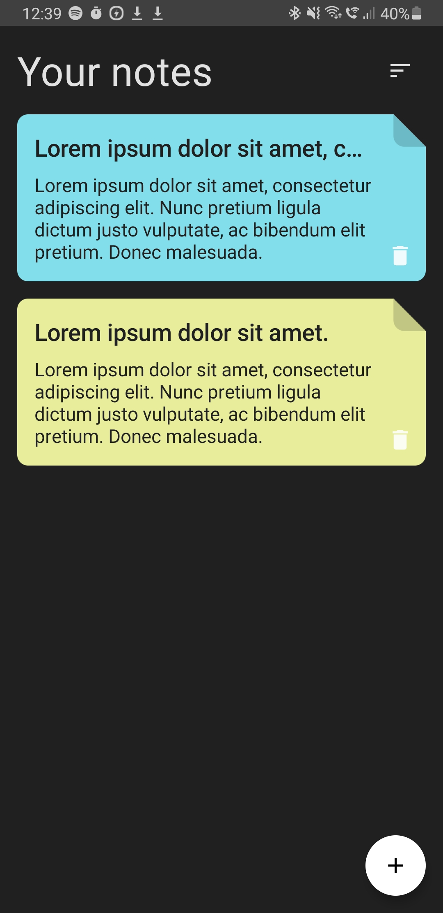

# NoteApp

## About

Application that enables users to enter their notes and then delete or edit them. This project was my first touch with Jetpack Compose. It was created with the help of Philipp Lackner's course

## Screenshots from the app

### Notes screen

### Notes screen

### Adding and editing notes

     

## Installation

You can clone this project to your Android Studio and then generate .apk.
